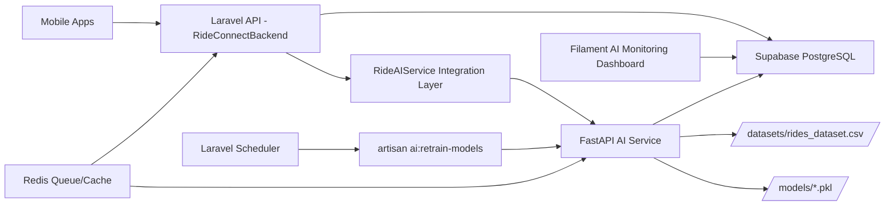

# RideConnect Independent AI System Upgrade

## 1) Architecture Diagram

## 2) Missing Components Identified

- Missing Laravel service integration layer for clean AI API communication.
- Missing required `/predict/*` endpoint contract in FastAPI.
- Missing periodic dataset extraction pipeline into `/datasets/rides_dataset.csv`.
- Missing unified `train_models.py` for full model training/evaluation/saving.
- Missing AI-specific historical data tables: `ride_requests`, `passenger_locations`, `ride_events`, `ride_cancellations`, `traffic_events`, `demand_logs`.
- Missing AI monitoring persistence tables: `ai_prediction_logs`, `ai_model_metrics`.
- Missing AI retraining scheduler command integration in Laravel.
- Missing Filament AI monitoring dashboard page.

## 3) Improved AI Pipeline

1. Laravel captures ride lifecycle + location events into AI training tables.
2. FastAPI dataset pipeline extracts internal platform data from Supabase.
3. Dataset builder cleans and engineers features:
   - `distance`
   - `estimated_time`
   - `demand_density`
   - `driver_density`
   - `traffic_level`
   - `time_of_day`
   - `day_of_week`
   - `weather`
4. `train_models.py` trains and evaluates independent models.
5. Models are saved to:
   - `models/driver_matching.pkl`
   - `models/eta_prediction.pkl`
   - `models/demand_prediction.pkl`
   - `models/surge_model.pkl`
6. FastAPI serves predictions on required routes.
7. Laravel scheduler triggers daily retraining.
8. Filament dashboard visualizes model metrics + operational AI logs.

## 4) Implementation Inventory

### Laravel

- Service integration:
  - `app/Services/RideAIService.php`
  - `app/Http/Controllers/Api/AIController.php`
  - `config/services.php` (`ride_ai` config)
  - `routes/api.php` (`/v1/ai/*` endpoints)

- Data collection pipeline:
  - `app/Services/AITrainingDataLogger.php`
  - `app/Http/Controllers/Api/TripController.php` (lifecycle logging)
  - `app/Http/Controllers/API/DriverLocationController.php` (location logging)

- Migrations:
  - `database/migrations/2026_03_13_090000_create_ai_data_pipeline_tables.php`
  - `database/migrations/2026_03_13_091000_align_rides_table_for_ai_training.php`

- Retraining:
  - `app/Console/Commands/RetrainAIModels.php`
  - `routes/console.php` daily scheduler entry

- Monitoring dashboard:
  - `app/Filament/Pages/AIMonitoringDashboard.php`
  - `app/Filament/Widgets/AIModelAccuracyWidget.php`
  - `app/Filament/Widgets/AIDemandHeatmapWidget.php`
  - `app/Filament/Widgets/AIDriverDistributionWidget.php`
  - `app/Filament/Widgets/AIPredictionLogsWidget.php`
  - `resources/views/filament/widgets/ai-*.blade.php`

### AI Service

- Dataset generation:
  - `training/dataset_pipeline.py`

- Training pipeline:
  - `train_models.py`

- Inference + admin routes:
  - `api/routes/predict.py`
  - `api/routes/admin.py`
  - `api/server.py` router registration

- Deployment alignment:
  - `Dockerfile`
  - `docker/Dockerfile`
  - `docker-compose.yml`

## 5) Performance Targets and Scalability Recommendations

### Target checks

- Driver matching latency < 200 ms: achievable with in-memory model loading + nearest-neighbor inference and optional Redis cache.
- ETA error < 15%: achievable if retraining cadence is daily and data quality includes robust pickup/dropoff timestamps.
- Demand prediction accuracy > 70%: achievable with enough historical demand depth and zone-level enrichment.

### Recommendations for 10,000+ daily rides

- Use Redis for:
  - prediction result caching
  - queue-backed asynchronous retraining/inference jobs
- Add async inference mode:
  - request accepted by Laravel
  - job queued
  - result fetched by job id
- Add event streaming (Kafka/Pulsar) for high-volume ride/driver telemetry.
- Add read replicas/materialized aggregates for dashboard and model features.
- Add geospatial indexes and partitioning for event tables.

## 6) Production Deployment Guide

1. Run Laravel migrations:
   - `php artisan migrate --force`
2. Ensure environment variables:
   - Laravel:
     - `RIDE_AI_BASE_URL=http://ai-service:8001`
     - `RIDE_AI_API_KEY=<shared-key>`
   - AI service:
     - `DATABASE_URL=<supabase-postgres-url>`
     - `API_KEY=<shared-key>`
3. Build and deploy AI service container with new `api.server` entrypoint.
4. Generate dataset and initial models:
   - `python train_models.py`
5. Verify API endpoints:
   - `POST /predict/match-driver`
   - `POST /predict/eta`
   - `POST /predict/demand-hotspots`
   - `POST /predict/surge-pricing`
6. Enable scheduler:
   - Laravel scheduler runs `ai:retrain-models` daily.
7. Validate Filament AI Monitoring Dashboard with live metrics/logs.
